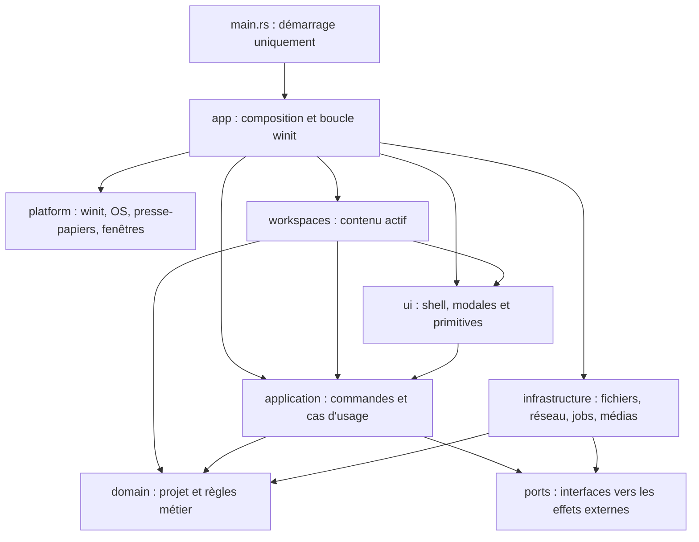

# Plan de refactor V4 — architecture extensible et dette technique

> Statut : document de planification uniquement.
>
> Ce document ne demande ni l'ajout d'onglets, ni l'ajout d'un mode d'enregistrement, ni un changement fonctionnel. Il décrit comment réorganiser progressivement le code existant afin que ces évolutions puissent être réalisées plus tard sans nouvelle réécriture globale.

## 1. Objectifs et contraintes

### Objectifs

- Rendre l'application SOLID, DRY et maintenable sans modifier son comportement observable.
- Réduire les responsabilités des fichiers monolithiques et rendre leurs dépendances explicites.
- Obtenir une boucle d'application, un état, une UI et un moteur de bande rythmo composés de sous-systèmes testables isolément.
- Préparer une frontière de type « espace de travail » capable d'accueillir plus tard plusieurs onglets.
- Centraliser les raccourcis et permettre qu'une même combinaison déclenche une commande différente selon le contexte actif.
- Supprimer les duplications de logique, notamment entre interaction, mutations locales/distantes et rendus CPU/GPU.
- Optimiser uniquement les chemins mesurés, avec des résultats et un rendu strictement équivalents.

### Contraintes non négociables

- Aucun onglet, barre d'onglets, changement d'onglet ou état multi-onglets visible ne doit être ajouté pendant ce refactor.
- Aucun espace de travail d'enregistrement, capture audio, périphérique d'entrée, waveform d'enregistrement ou dépendance associée ne doit être ajouté.
- Aucun nouveau raccourci et aucune modification de la signification, de la priorité ou de la répétition des raccourcis existants.
- Aucun changement de format projet, de protocole réseau, de sérialisation, de rendu visuel, de workflow, de texte UI ou de valeur par défaut.
- Aucun mélange entre extraction structurelle et évolution produit dans une même PR.
- Les optimisations ne sont acceptées qu'après mesure, avec tests de non-régression et sans approximation visuelle supplémentaire.
- Chaque étape doit pouvoir être livrée et annulée indépendamment. Le projet doit compiler et passer ses tests à la fin de chaque PR.

## 2. État des lieux au 14 juillet 2026

Le projet est un crate binaire : les modules sont déclarés dans `main.rs` et il n'existe pas encore de `lib.rs`. La commande `cargo test --locked` passe actuellement avec **89 tests**, mais la cible de test du binaire produit **112 avertissements**.

| Zone | Taille actuelle | Responsabilités mélangées |
|---|---:|---|
| `src/main.rs` | 1 583 lignes | bootstrap, fenêtre, presse-papiers, sélecteurs de fichiers, exécution de toutes les `UiAction`, traduction clavier, boucle `winit` |
| `src/state.rs` | 3 538 lignes | GPU, fenêtres, UI, vidéo/audio, projet, historique, réseau, jobs, sauvegarde, rendu, mode studio |
| `src/ui/mod.rs` | 3 587 lignes | shell, layout, toolbar, modales, événements, rendu, caches et état de la bande rythmo |
| `src/ui/rythmo.rs` | 6 778 lignes | géométrie, état transitoire, hit-testing, édition de texte, drag, sélection, karaoké, dessin, menus et rendu |
| `src/rythmo_gpu_renderer.rs` | 2 962 lignes | préparation de scène, layout, caches et backend GPU |
| `src/rythmo_cpu_renderer.rs` | 1 587 lignes | préparation de scène dupliquée et backend CPU |
| `src/ui/file_explorer_modal.rs` | 2 383 lignes | modèle de fichiers, navigation, événements et rendu de la modale |
| `src/video_export.rs` | 1 776 lignes | orchestration export, FFmpeg, audio, frames et choix du backend |

### Couplages structurants à corriger

1. `UiAction` se trouve dans `ui/widget.rs`, alors qu'il s'agit de commandes applicatives utilisées par `main.rs`, `state.rs` et toute l'UI.
2. `State` connaît les détails internes de `Ui`, `RythmoState`, `NetworkClient`, `VideoPlayer`, `wgpu`, des fenêtres et des jobs asynchrones.
3. L'UI reçoit un `&mut Project` et mélange état d'interaction, lecture du domaine et émission de mutations.
4. Les entrées clavier sont interprétées dans `main.rs`, puis parfois une seconde fois dans `Ui` et `ui/rythmo.rs`. Leur priorité dépend de l'ordre des `if`.
5. Une mutation de projet existe sous plusieurs formes : `UiAction`, méthode de `State`, `Command`, `CommandPayload`, delta JSON et application distante.
6. Les chemins local, undo/redo, synchronisation complète, paquet typé et delta JSON ne passent pas tous par une unique porte de mutation.
7. La préparation visuelle de la bande rythmo est répétée entre l'UI temps réel, le rendu studio, le renderer CPU et le renderer GPU.
8. Les accès par identifiant, tris, clones et reconstructions de caches sont encore présents dans des chemins par frame ou par événement.
9. Les dépendances pointent dans les deux sens : le domaine est importé par l'UI, mais `state.rs` importe aussi des types concrets de l'UI pour piloter le domaine.

## 3. Architecture cible

### Règle de dépendance



Les règles suivantes devront être respectées :

- `domain` ne dépend ni de `ui`, ni de `winit`, ni de `wgpu`, ni du réseau, ni du système de fichiers.
- `application` dépend du domaine et de petits ports, jamais des adaptateurs concrets.
- `ui` et un espace de travail lisent des modèles de vue et émettent des commandes ; ils ne modifient pas directement le projet.
- `infrastructure` et `platform` implémentent les ports définis vers l'intérieur.
- `app` est la seule racine de composition et la seule zone autorisée à relier des implémentations concrètes.
- Le backend CPU et le backend GPU consomment une même description de scène, sans s'importer mutuellement.

### Arborescence cible indicative

Cette arborescence donne les frontières désirées. Elle doit être atteinte progressivement, avec des déplacements qui préservent l'historique Git ; elle n'est pas à créer vide en une seule PR.

```text
src/
├── main.rs                       # init du logger puis appel au bootstrap
├── lib.rs                        # modules testables du produit
├── app/
│   ├── mod.rs                    # App, composition de haut niveau
│   ├── bootstrap.rs              # config, i18n, update, création initiale
│   ├── event_loop.rs             # traduction des événements winit
│   ├── events.rs                 # AppEvent internes
│   └── dispatcher.rs             # exécution d'une commande applicative
├── application/
│   ├── command.rs                # familles de commandes sémantiques
│   ├── context.rs                # contexte actif en lecture seule
│   ├── project_service.rs        # ouvrir, sauvegarder, importer
│   ├── edit_service.rs           # mutations, historique, dirty flag
│   └── playback_service.rs       # lecture, seek, volume, audio actif
├── domain/
│   ├── project/                  # Project, lignes, personnages, marqueurs
│   ├── drawing/                  # dessins et transformations
│   ├── history/                  # commandes réversibles
│   └── syllable/                 # découpage et ratios
├── input/
│   ├── key.rs                    # frappe normalisée + modificateurs
│   ├── context.rs                # pile de contextes actifs
│   ├── binding.rs                # association contexte + frappe -> commande
│   └── router.rs                 # résolution déterministe et testable
├── workspaces/
│   ├── mod.rs                    # contrat et hôte d'un espace actif
│   └── rythmo/
│       ├── mod.rs                # adaptateur de l'espace actuel
│       ├── state.rs              # état UI transitoire seulement
│       ├── controller.rs         # événements -> commandes
│       ├── selection.rs
│       ├── text_edit.rs
│       ├── drag.rs
│       ├── drawing.rs
│       ├── context_menu.rs
│       ├── geometry.rs
│       ├── karaoke.rs
│       └── view.rs               # construction du modèle de vue
├── ui/
│   ├── shell/                    # topbar, toolbar, layout, propriétés, progrès
│   ├── modal/                    # modales existantes
│   ├── primitives/               # Widget, Rect, boutons, inputs, thème
│   └── renderer/                 # rendu générique de l'UI
├── rendering/
│   └── rythmo/
│       ├── scene.rs              # scène commune indépendante du backend
│       ├── layout.rs
│       ├── cache.rs
│       └── backend/
│           ├── cpu.rs
│           └── gpu.rs
├── media/                        # player, proxy, export et binaires externes
├── collaboration/                # client, protocole et codecs legacy
├── infrastructure/               # stockage, jobs et adaptateurs concrets
├── platform/                     # fenêtres et presse-papiers par OS
└── ports/                        # interfaces fines vers les effets externes
```

Les noms exacts peuvent évoluer pendant l'exécution du plan. Les frontières de dépendances, elles, ne doivent pas être diluées.

## 4. Deux points d'extension à préparer sans ajouter les fonctionnalités

### 4.1 Espace de travail extensible

Introduire un contrat interne `Workspace` et un `WorkspaceHost` :

- le shell commun conserve topbar, menus globaux, modales, notifications, projet, lecture et fenêtres ;
- l'espace de travail possède uniquement son état UI transitoire, son contrôleur d'interaction, son modèle de vue, son rendu de contenu et ses raccourcis contextuels ;
- `WorkspaceHost` expose l'espace actif au shell et au routeur d'entrée ;
- pendant tout ce refactor, **une seule implémentation produit est enregistrée : l'espace bande rythmo existant** ;
- aucun bouton de changement, aucune collection d'onglets visible et aucune persistance de sélection d'onglet ne sont ajoutés ;
- un faux espace de travail limité aux tests peut valider le contrat d'extension sans créer de fonctionnalité produit.

Le contrat doit rester petit. Il doit couvrir : identité stable, contexte d'entrée, gestion des événements de contenu, production de commandes, modèle de toolbar contextuelle, besoin de redraw et rendu. Il ne doit pas exposer `State`, `Ui` ou des champs internes du projet.

Le futur ajout d'un espace de travail devra être localisé à un nouveau module et à son enregistrement dans la racine de composition. Il ne devra pas nécessiter de modifier `main.rs`, le routeur clavier, le shell ou l'espace bande rythmo.

### 4.2 Raccourcis dépendants du contexte

Séparer trois notions aujourd'hui confondues :

1. **Entrée physique/logique** : touche, modificateurs, état pressé/relâché, répétition et fenêtre source.
2. **Contexte actif** : modale, édition de texte, mode studio, fenêtre secondaire, espace de travail actif, outil actif et contexte global.
3. **Commande sémantique** : sauvegarder, lire/pause, supprimer une sélection, copier du texte, copier une ligne, etc.

Le routeur reçoit une frappe normalisée et une pile ordonnée de contextes. Il cherche la première association active. Une même frappe peut donc apparaître plusieurs fois dans la table, à condition que les contextes soient différents. Le routeur ne contient aucun `if WorkspaceId == ...`.

La priorité initiale doit reproduire exactement l'ordre actuel, même lorsque cet ordre paraît discutable :

1. fenêtre et mode exclusifs actuellement traités avant le reste ;
2. modale capturante ;
3. édition de texte ;
4. contexte de l'espace bande rythmo et de son outil actif ;
5. commandes globales.

Avant de déplacer une condition, créer une table de caractérisation à partir de `main.rs`, incluant au minimum : F5, Échap, Espace, Tab, Suppr, Ctrl+K, Ctrl+S, Ctrl+N, Ctrl+A/C/X/V/Z, Ctrl+Maj+Z, les flèches, la répétition et la fenêtre secondaire. Les tests doivent fixer le résultat dans chaque contexte actuel. Le refactor ne doit pas « corriger » les incohérences observées ; une correction éventuelle sera une évolution séparée.

Les clics de boutons et les raccourcis doivent finir par émettre la même commande sémantique. `UiEvent` doit rester un événement d'interaction bas niveau et ne plus héberger les commandes applicatives.

## 5. Plan de migration incrémental

### Phase 0 — Figer les comportements et les mesures

**But :** disposer d'un filet de sécurité avant tout déplacement.

Travaux :

- Documenter la baseline : `cargo test --locked` = 89 tests réussis et 112 avertissements au démarrage du chantier.
- Ajouter une checklist de smoke test manuelle pour ouverture/sauvegarde/import/export, lecture vidéo, audio, édition de ligne, historique, karaoké, dessin, modales, réseau, mode studio et écran secondaire.
- Créer des fixtures projet représentatives : vide, petit projet, gros projet, karaoké, dessins, personnages/comédiens et marqueurs.
- Ajouter des tests de caractérisation autour des raccourcis et de leur ordre de priorité actuel.
- Ajouter des goldens de sérialisation pour le JSON projet, les `Packet`, les `CommandPayload` et les deltas JSON existants.
- Ajouter des tests de caractérisation pour une mutation locale, undo, redo, réception distante, synchronisation complète, `dirty` et révision du projet.
- Capturer des scènes déterministes de bande rythmo sous forme de données comparables avant d'utiliser des captures de pixels, plus fragiles.
- Mesurer en release sur les mêmes fixtures : temps de construction d'une frame, nombre de lignes visitées, tris, allocations/clones significatifs, temps de lookup par ID et temps d'export d'un segment court.

Critère de sortie : les comportements critiques ont un test ou une entrée de checklist, les formats externes ont un golden et les mesures sont reproductibles.

### Phase 1 — Créer une bibliothèque et amincir `main.rs`

**But :** obtenir une racine de composition claire sans toucher au comportement.

Travaux :

- Ajouter `src/lib.rs` et y déplacer les déclarations de modules afin que les tests ne dépendent plus de la cible binaire.
- Extraire le bootstrap config/i18n/update et la création de fenêtre dans `app/bootstrap.rs`.
- Extraire la boucle `winit` dans `app/event_loop.rs` derrière une structure `App`.
- Déplacer le code OS de fenêtre, icône et presse-papiers dans `platform`.
- Déplacer les helpers de sélecteur de fichiers dans un service dédié, sans changer les filtres ni les chemins initiaux.
- Conserver temporairement l'ancien `handle_action` derrière le dispatcher afin de limiter la taille de la PR.

Critère de sortie : `main.rs` ne fait que configurer le processus et lancer `App`; les 89 tests initiaux et les tests de caractérisation passent.

### Phase 2 — Séparer événements, commandes et raccourcis

**But :** rendre le comportement clavier explicite et prêt pour plusieurs contextes.

Travaux :

- Déplacer `UiAction` hors de `ui/widget.rs` vers `application/command.rs`.
- Regrouper les commandes par familles bornées (`GlobalCommand`, `ProjectCommand`, `PlaybackCommand`, `RythmoCommand`, `ShellCommand`) plutôt que de laisser croître un enum plat.
- Laisser les widgets produire des commandes applicatives, mais garder les événements souris/texte dans `ui/primitives`.
- Introduire l'adaptateur `winit -> KeyStroke`, la pile `InputContext` et le `ShortcutRouter`.
- Déclarer les associations globales et bande rythmo dans des tables proches de leur propriétaire.
- Centraliser la politique de répétition et les modificateurs ; ne pas déduire Ctrl+Maj+Z uniquement de la casse du caractère.
- Remplacer progressivement la cascade clavier de `main.rs` par le routeur, une association à la fois, test de parité à l'appui.
- Faire passer clic toolbar et raccourci par le même dispatcher.

Critère de sortie : aucune combinaison produit un résultat différent de la matrice initiale ; l'ajout d'un faux contexte dans un test permet de réutiliser une frappe avec une autre commande sans modifier le routeur.

### Phase 3 — Décomposer `State` et le dispatcher applicatif

**But :** remplacer le god object par une composition de composants cohérents.

Décomposition visée :

- `ProjectSession` : projet, chemin, `dirty`, historique et index dérivés ;
- `PlaybackSession` : player, vidéo source/proxy, taille, audio actif, volume et timeline ;
- `CollaborationSession` : client réseau, état de salon et messages entrants ;
- `JobManager` : import, proxy, export, annulation et progression ;
- `WindowManager` : fenêtre principale, secondaire, fullscreen et mode studio ;
- `RenderCoordinator` : contexte graphique, surfaces et orchestration des renderers ;
- `UiShell` et `WorkspaceHost` : état de présentation, séparé du domaine.

Travaux :

- Créer `AppContext` comme agrégat de ces composants, sans réintroduire toutes leurs méthodes en simple délégation.
- Déplacer `handle_action` de `main.rs` dans un `CommandDispatcher` qui appelle des cas d'usage ciblés.
- Extraire d'abord les groupes faiblement couplés : jobs, fenêtre secondaire, fichiers, playback, puis collaboration et édition.
- Définir de petits ports pour presse-papiers, ouverture de lien, stockage projet, file picker et lancement de jobs.
- Injecter les implémentations concrètes depuis `app`, sans conteneur de dépendances global ni service locator.
- Remplacer les accès publics `state.project`, `state.network` et `state.gfx` par les API du composant propriétaire.

Critère de sortie : la boucle d'événements ne contient plus de logique métier ; chaque composant a une raison principale de changer et peut être testé avec des doubles simples.

### Phase 4 — Unifier les mutations, l'historique et le réseau

**But :** établir une unique porte d'entrée pour toute modification du projet.

Travaux :

- Faire de la commande de domaine la représentation canonique d'une édition réversible.
- Centraliser `apply`, `revert`, coalescing, mise à jour de `dirty`, révision, invalidation d'index et notification.
- Faire passer les mutations locales, undo/redo et commandes distantes par un `EditExecutor` avec une origine explicite (`Local`, `UndoRedo`, `Remote`, `Import`, `Sync`).
- Définir par origine les effets actuels : ajout ou non à l'historique, broadcast ou non, `dirty` ou non et toast éventuel. Ces règles sont figées par tests avant migration.
- Isoler les conversions réseau dans des codecs : commande canonique vers `Packet`/delta legacy, et payload/delta legacy vers commande validée.
- Conserver strictement les clés JSON, noms de variantes et structures sérialisées actuelles.
- Encapsuler les collections du `Project` et interdire les mutations qui oublient `bump_revision` ou l'invalidation d'index.
- Regrouper les commandes par domaine (lignes, marqueurs, personnages, voix, dessins) afin que chaque module porte sa logique et ses tests.

Critère de sortie : aucune mutation de projet en production ne contourne l'exécuteur, et les goldens prouvent la compatibilité réseau et fichier.

### Phase 5 — Décomposer le shell UI et les modales

**But :** faire de `Ui` un composite léger au lieu d'un second god object.

Travaux :

- Séparer layout, topbar, toolbar, progress bar, propriétés, toasts et overlays dans `ui/shell`.
- Déplacer `Widget`, `Rect`, `UiEvent`, primitives et thème dans `ui/primitives`.
- Introduire un `ModalHost` qui route événement et rendu vers la modale active et retourne un `ModalOutcome` converti en commande.
- Garder chaque modale propriétaire de ses champs, de son layout et de ses événements ; le shell ne conserve plus une méthode `handle_*` par modale.
- Décomposer `file_explorer_modal.rs` en modèle de navigation, chargement asynchrone, layout, contrôleur et vue.
- Remplacer les nombreux paramètres de rendu par des structures de contexte en lecture seule cohésives, sans y remettre tout `AppContext`.
- Faire lire à l'UI des modèles de vue immuables ; les changements métier restent des commandes.

Critère de sortie : `ui/mod.rs` est un module de composition court, l'ajout d'une modale ne requiert pas de modifier plusieurs grands `match`, et aucun widget ne modifie directement `Project`.

### Phase 6 — Transformer la bande rythmo en espace de travail

**But :** isoler complètement la fonctionnalité existante derrière le contrat `Workspace`.

Travaux :

- Créer l'unique implémentation produit `RythmoWorkspace` et l'enregistrer dans `WorkspaceHost`.
- Déplacer l'état éphémère de `RythmoState` vers des sous-états cohésifs : viewport/pan, sélection, drag, édition de texte, syllabes, outil de dessin, menu contextuel et caches.
- Déplacer les fonctions pures de coordonnées, hit-testing et layout dans `geometry`/`layout`.
- Séparer les contrôleurs pointer, clavier texte, sélection, drag, syllabes, dessin et menu contextuel.
- Faire émettre au contrôleur des `RythmoCommand` sans muter le domaine.
- Faire fournir par l'espace de travail sa toolbar contextuelle et ses associations de raccourcis.
- Conserver le shell, le playback et les modales hors de l'espace de travail.
- Ne créer aucun second espace produit, aucune collection visible et aucune commande de changement d'onglet.

Critère de sortie : `ui/rythmo.rs` n'existe plus comme fichier monolithique ; l'espace bande rythmo peut être instancié et testé sans fenêtre ni GPU pour ses interactions pures.

### Phase 7 — Partager la scène de rendu CPU/GPU

**But :** supprimer la duplication de logique visuelle tout en conservant deux backends spécialisés.

Travaux :

- Construire une `RythmoScene` indépendante de `wgpu` contenant uniquement les éléments visibles : géométrie, couleurs, textes, progression karaoké, marqueurs, dessins, badges et icônes.
- Déplacer dans le scene builder les calculs actuellement recopiés entre UI, studio, CPU et GPU : fenêtres visibles, tracks, alternance karaoké, count-in, positions et règles de labels.
- Faire du renderer GPU un adaptateur `RythmoScene -> buffers/textures`.
- Faire du renderer CPU un adaptateur `RythmoScene -> pixels`.
- Garder dans chaque backend uniquement ses caches et contraintes techniques propres ; ne pas forcer une abstraction commune pour des détails réellement différents.
- Décomposer `video_export.rs` en pipeline, préparation audio, frame source, composition et invocation FFmpeg.
- Utiliser la même scène pour preview, studio, écran secondaire et export lorsque les règles actuelles sont identiques ; représenter explicitement les différences existantes par des options de scène testées.
- Comparer les données de scène et des captures de référence sur un ensemble réduit de frames clés.

Critère de sortie : une règle visuelle métier n'est implémentée qu'une fois, les backends restent interchangeables au niveau de la scène, et les références visuelles ne changent pas.

### Phase 8 — Optimiser les chemins mesurés

**But :** corriger les sous-optimisations sans transformer le refactor en réécriture spéculative.

Travaux possibles, uniquement si la baseline les confirme :

- Conserver l'ordre sérialisé des lignes mais ajouter un index `id -> position` reconstruit/incrémenté avec la révision, au lieu de remplacer naïvement le `Vec` par un `HashMap`.
- Faire porter à `ProjectRenderIndex` les recherches de visibilité et maxima déjà nécessaires aux différents renderers.
- Mettre en cache layouts, scènes statiques, largeurs de texte, segmentation syllabique et regroupements karaoké avec une clé de révision explicite.
- Éviter les tris par frame en triant lors de l'invalidation, pas lors du rendu.
- Réduire les clones de texte, ratios, points de dessin et snapshots en utilisant des emprunts ou des données partagées immuables lorsque leur durée de vie reste claire.
- Séparer tick vidéo, polling réseau/jobs et redraw pour ne réveiller que le sous-système nécessaire.
- Ajouter des compteurs debug de cache hit/miss et de lignes visitées, désactivables en release si leur coût n'est pas nul.
- Comparer médiane et dispersion sur les fixtures de la phase 0 ; refuser une optimisation qui dégrade un autre chemin critique sans justification mesurée.

Critère de sortie : chaque optimisation possède un benchmark avant/après, les résultats visuels et fonctionnels restent identiques et aucune cache n'a de chemin d'invalidation implicite.

### Phase 9 — Nettoyage, documentation et garde-fous

**But :** empêcher le retour à l'architecture initiale.

Travaux :

- Supprimer les façades temporaires et anciens chemins seulement quand tous les appels ont migré.
- Traiter le code mort et les avertissements, après vérification par tests qu'ils ne représentent pas un chemin plateforme dormant.
- Ajouter des docs de module décrivant responsabilité, dépendances autorisées et invariants.
- Rendre obligatoires `cargo fmt --check`, `cargo test --locked` et `cargo clippy --all-targets --locked -- -D warnings` dans la CI lorsque la baseline est propre.
- Ajouter une vérification légère des imports interdits (`domain -> ui/winit/wgpu`, par exemple).
- Documenter comment ajouter plus tard un espace de travail et des bindings contextuels, avec un exemple de test uniquement, sans implémenter de nouvelle fonctionnalité.
- Mettre à jour le rapport de dette technique obsolète une fois le chantier terminé.

Critère de sortie : zéro avertissement, frontières documentées et contrôlées, aucun ancien chemin parallèle et aucune dépendance cyclique cachée.

## 6. Stratégie de tests de non-régression

### Tests unitaires purs

- Résolution d'une frappe selon la pile de contextes, priorité, répétition et modificateurs.
- Contrat de l'espace de travail avec un double de test.
- Géométrie, hit-testing, sélection, drag, curseur texte, syllabes et layout bande rythmo.
- Application et annulation de chaque commande de domaine.
- Index de projet, invalidation par révision et sélection des éléments visibles.
- Construction déterministe de `RythmoScene`.

### Tests de contrat et d'intégration

- Même commande issue d'un bouton et d'un raccourci.
- Pipeline `commande locale -> apply -> historique -> broadcast`.
- Pipeline `payload/delta distant -> decode -> validation -> apply`, sans rebroadcast involontaire.
- Parité undo/redo, `dirty`, sauvegarde et import.
- Jobs import/proxy/export avec adaptateurs factices et annulation.
- Shell + modale : capture des événements et restitution du focus.
- `App` headless autant que possible ; garder les tests nécessitant GPU/fenêtre dans une catégorie séparée.

### Goldens et smoke tests

- JSON projet avant/après round-trip strictement compatible.
- `Packet`, `CommandPayload` et delta JSON compatibles avec les versions existantes.
- Scènes/captures sur frames clés : ligne normale, karaoké, marqueurs, waveform, dessins, studio et export.
- Smoke test Windows, puis plateformes conditionnelles déjà supportées.
- Vérification manuelle des raccourcis dans édition texte, espace bande rythmo, modales, studio et fenêtre secondaire.

## 7. Règles de taille et de conception

La taille n'est pas une architecture, mais elle sert de signal :

- `main.rs` cible : moins de 150 lignes, sans logique métier.
- Un orchestrateur (`App`, dispatcher, shell, workspace) cible : moins de 500 lignes.
- À partir de 800 lignes de code de production, une revue de responsabilité est obligatoire.
- Au-delà de 1 200 lignes, le fichier doit être découpé ou documenté comme exception technique précise.
- Un module n'est pas découpé uniquement pour satisfaire une limite : chaque sous-module doit posséder un vocabulaire, des invariants et des tests cohérents.
- Préférer la composition et des structures de contexte ciblées à une prolifération de traits à une seule implémentation.
- N'introduire un trait que pour une vraie frontière : espace de travail, backend, port externe ou double de test utile.
- Ne pas remplacer un god object par un `AppContext` passé partout ou par un event bus non typé.

## 8. Application de SOLID et DRY

| Principe | Application concrète |
|---|---|
| Responsabilité unique | Sessions projet/playback/réseau/jobs/fenêtres distinctes ; contrôleurs bande rythmo séparés du rendu |
| Ouvert/fermé | Nouveau workspace ou backend ajouté derrière un contrat et enregistré à la composition, sans condition dans `main.rs` |
| Substitution | Tests de contrat identiques pour workspace test et backends de scène là où leur comportement doit coïncider |
| Ségrégation d'interface | Ports fins (`Clipboard`, `ProjectStorage`, `FilePicker`, `JobLauncher`) plutôt qu'une interface `Services` globale |
| Inversion de dépendance | Cas d'usage dépendant de ports ; adaptateurs Winit, OS, réseau et fichiers branchés dans `app` |
| DRY | Une mutation canonique, une table de raccourcis par propriétaire et une scène visuelle commune ; pas un fichier `utils.rs` fourre-tout |

## 9. Risques principaux et parades

| Risque | Parade |
|---|---|
| Changement silencieux de priorité clavier | Matrice exhaustive avant migration et remplacement association par association |
| Régression de sérialisation/réseau | Goldens byte/JSON et codecs legacy isolés |
| Mutation oubliant historique, dirty ou broadcast | Porte unique `EditExecutor` et tests par origine |
| Cycles d'emprunts Rust après décomposition | Données de vue immuables, commandes en sortie, composants propriétaires de leur état |
| Explosion d'abstractions | Traits réservés aux vraies frontières ; structures concrètes ailleurs |
| Simple déplacement de milliers de lignes | Critère de responsabilité et tests propres à chaque nouveau module |
| Divergence CPU/GPU | `RythmoScene` commune et références sur les mêmes frames |
| Cache obsolète | Clé de révision explicite et tests d'invalidation |
| PR impossible à relire | Une frontière ou une famille de commandes par PR, sans renommage/formatage global simultané |
| Refactor interminable | Chaque phase est livrable ; supprimer les couches de compatibilité à la phase suivante, pas en fin de chantier uniquement |

## 10. Découpage recommandé des PR

Chaque ligne représente une PR ou un petit groupe de PR homogènes :

1. Baseline, fixtures, matrice clavier et goldens.
2. `lib.rs` et déplacement des déclarations de modules.
3. Bootstrap, plateforme et boucle d'application.
4. Commandes applicatives sorties de `widget.rs`.
5. Routeur de raccourcis avec parité complète.
6. Extraction du dispatcher de `main.rs`.
7. Extraction jobs et file picker.
8. Extraction playback et fenêtres.
9. Extraction collaboration.
10. `ProjectSession` et porte de mutation canonique.
11. Migration undo/redo puis codecs réseau vers cette porte.
12. Shell UI et primitives.
13. `ModalHost`, puis migration des modales par lots.
14. Décomposition du file explorer.
15. Contrat `Workspace` et adaptation de la bande rythmo existante.
16. Décomposition interaction/état bande rythmo.
17. `RythmoScene` et migration du rendu temps réel.
18. Migration CPU, studio et export vers la scène commune.
19. Optimisations mesurées, une catégorie par PR.
20. Suppression des façades, zéro warning, docs et règles CI.

Il ne faut pas ouvrir simultanément plusieurs PR qui déplacent les mêmes fichiers monolithiques. Les phases peuvent être parallélisées seulement lorsqu'elles touchent des frontières déjà stabilisées et des fichiers distincts.

## 11. Définition de terminé du refactor V4

Le chantier est terminé lorsque tous les points suivants sont vrais :

- Une seule implémentation produit d'espace de travail existe et l'application présente exactement l'UI actuelle.
- Aucun code d'enregistrement audio ni aucune UI d'onglets n'a été introduit.
- `main.rs` est une entrée mince et ne connaît ni `UiAction`/commandes métier, ni projet, ni réseau, ni renderer.
- Les raccourcis sont déclaratifs, centralisés par propriétaire et résolus par une pile de contextes testée.
- Une même frappe peut produire deux commandes différentes dans deux faux contextes de test sans condition ajoutée au routeur.
- Le shell commun et la bande rythmo sont séparés par le contrat `Workspace`.
- `State`, `Ui` et `ui/rythmo.rs` n'existent plus sous leur forme monolithique.
- Toute mutation de projet passe par l'exécuteur canonique et conserve historique, réseau, dirty flag et révisions selon les règles actuelles.
- CPU, GPU, studio et export partagent les règles de construction de scène pertinentes.
- Le domaine n'importe aucun détail d'UI, de fenêtre, de GPU, de réseau ou de système de fichiers.
- Les formats projet et réseau restent compatibles avec les goldens de la phase 0.
- Les 89 tests initiaux, tous les nouveaux tests de caractérisation et la checklist manuelle passent.
- La compilation et Clippy ne produisent plus d'avertissement.
- Les mesures de performance ne régressent pas par rapport à la baseline ; chaque gain revendiqué est documenté.
- Les gros fichiers restants respectent les seuils ou possèdent une exception argumentée.

## 12. Hors périmètre explicite

Même si l'architecture les rendra possibles plus tard, les éléments suivants ne font pas partie du refactor V4 :

- création, affichage, fermeture, réordonnancement ou persistance d'onglets ;
- espace d'enregistrement, capture micro, monitoring, punch-in/out ou export de prises ;
- nouveau système configurable de raccourcis ou écran d'aide aux raccourcis ;
- modification UX des raccourcis existants ;
- nouveau format de projet ou migration du protocole réseau ;
- nouvelle fonctionnalité d'édition, de rendu, d'export ou de collaboration ;
- changement visuel, correction fonctionnelle opportuniste ou optimisation non mesurée.

Tout besoin découvert dans ces catégories doit être consigné séparément et traité après le refactor, dans une évolution produit dédiée.
